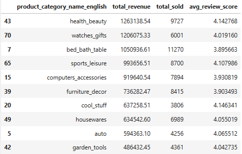
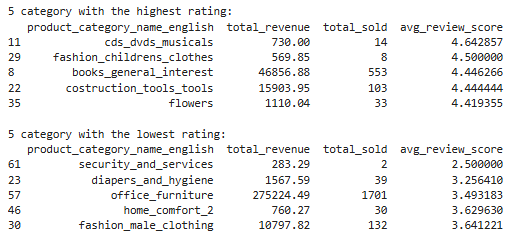
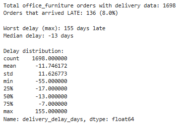
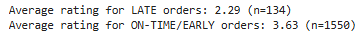
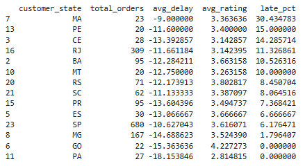
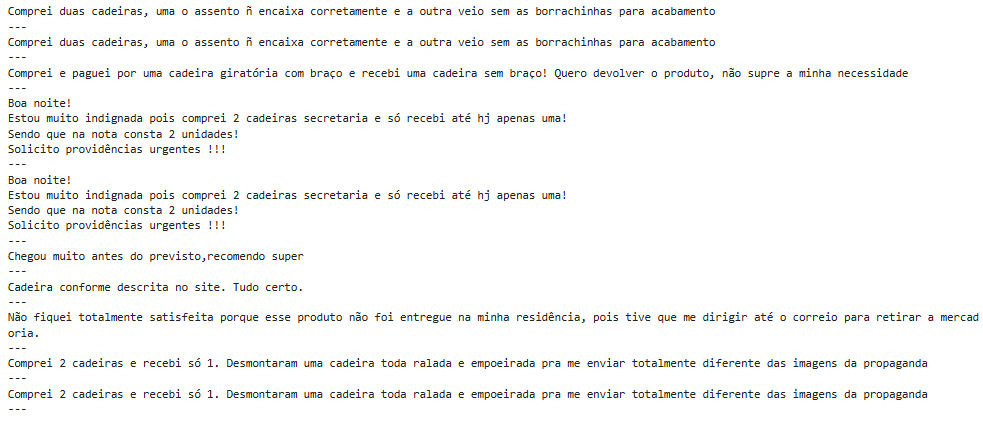

# Olist Product Category Analysis
Analysis of the Brazilian e-commerce dataset from Olist, exploring which product categories drive the most revenue and whether high sales volume is associated with better or worse customer satisfaction.
## Business Question

**Which product categories are most profitable for Olist sellers, and does high sales volume correlate with better or worse customer review ratings?**

## Dataset

The [Olist Brazilian E-Commerce Public Dataset](https://www.kaggle.com/datasets/olistbr/brazilian-ecommerce), containing real (anonymized) commercial data from ~100,000 orders placed on the Olist marketplace between 2016 and 2018. For this analysis, the following tables were combined:

- `orders` — order status and delivery timestamps
- `order_items` — items and prices per order
- `products` — product category information
- `product_category_name_translation` — Portuguese-to-English category names
- `order_reviews` — customer review scores and comments
- `customers` — customer location (state)

## Tools

Python (pandas, matplotlib) in Jupyter Notebook.

## Methodology

1. **Data cleaning**: checked for missing values and duplicates across all tables.
2. **Merging**: joined the relevant tables into a single dataset linking product category, price, freight cost, delivery timing, and review scores.
3. **Category-level analysis**: aggregated revenue, units sold, and average review score per category, filtering out categories with fewer than 100 sales to keep comparisons statistically reliable.
4. **Deep dive on the lowest-rated high-volume category**: tested multiple hypotheses (delivery delay, pricing/freight cost, regional patterns) rather than accepting the first plausible explanation, and validated each one against the actual numbers before drawing conclusions.
5. **Qualitative check**: read a sample of low-rating review comments to confirm what the numbers were suggesting.

## Key Findings

**1. Revenue leaders don't show a strong link between sales volume and review score overall.**
Among the top 10 categories by revenue, average ratings were fairly consistent (3.90–4.15), showing no dramatic pattern.

*Figure 1: Top 10 product categories by total revenue.*

**2. `office_furniture` stands out as an outlier.**
It's one of the highest-volume categories (1,701 units sold) but has one of the lowest average review scores (3.49) among all categories with reliable sample sizes (100+ sales).

*Figure 2: Categories with the lowest average review scores, limited to categories with 100+ sales. `office_furniture` has by far the highest sales volume among this group.*

**3. The initial hypothesis (late delivery) didn't fully explain it — but a deeper look did.**
On average, `office_furniture` orders arrived *earlier* than estimated, not later. However, further testing revealed:
- **8% of `office_furniture` orders were genuinely late** (up to 155 days late in the worst case).
- Orders that arrived late had a dramatically lower average rating (**2.29**) compared to on-time/early orders (**3.63**), confirming delay is a real driver of dissatisfaction for the subset it affects.
- Freight cost for `office_furniture` is disproportionately high: averaging 25% of item price, compared to 16.6% overall.

*Figure 3: Distribution of delivery delay for `office_furniture` orders. Most orders arrive early, but a small tail arrives extremely late (up to 155 days).*

*Figure 4: Average review score for late vs. on-time/early `office_furniture` orders.*

**4. Regional differences reveal a second, separate problem.**
State-level breakdown showed `PA` (Pará) as an anomaly: 0% of its orders were late, yet it had the *lowest* average rating (2.81) of any state. Reading customer review comments from this state revealed the root cause was different from the delay-driven issue: **incomplete orders (paying for 2 items, receiving 1), wrong product variants shipped, and product quality not matching the listing** — a fulfillment problem, not a shipping-time problem.

*Figure 5: Late delivery percentage and average rating by state (states with 20+ orders). `PA` stands out with 0% late deliveries but the lowest rating overall.*

*Figure 6: A sample of low-rating review comments from `PA` customers, pointing to incomplete/incorrect shipments rather than delivery delays.*

## Business Recommendations

- **Review the fulfillment process for `office_furniture`**, particularly around order completeness and product-variant accuracy, since this appears to be a distinct driver of dissatisfaction independent of delivery speed.
- **Investigate the small subset (~8%) of severely delayed `office_furniture` shipments**, since this group's rating (2.29) drags down the category average disproportionately relative to its size.
- **Reconsider freight pricing or communicate shipping costs more clearly upfront** for bulky/heavy categories like `office_furniture`, where freight is a much higher proportion of item price than average.

## Limitations

- Review comments were read qualitatively on a small sample; a full text analysis (e.g. sentiment analysis or keyword frequency) could strengthen these findings further.
- Regional findings for `PA` are based on 27 orders; while above the reliability threshold used in this analysis, a larger sample would increase confidence.
